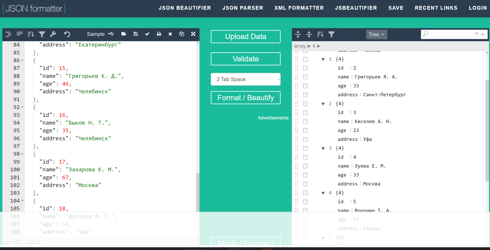
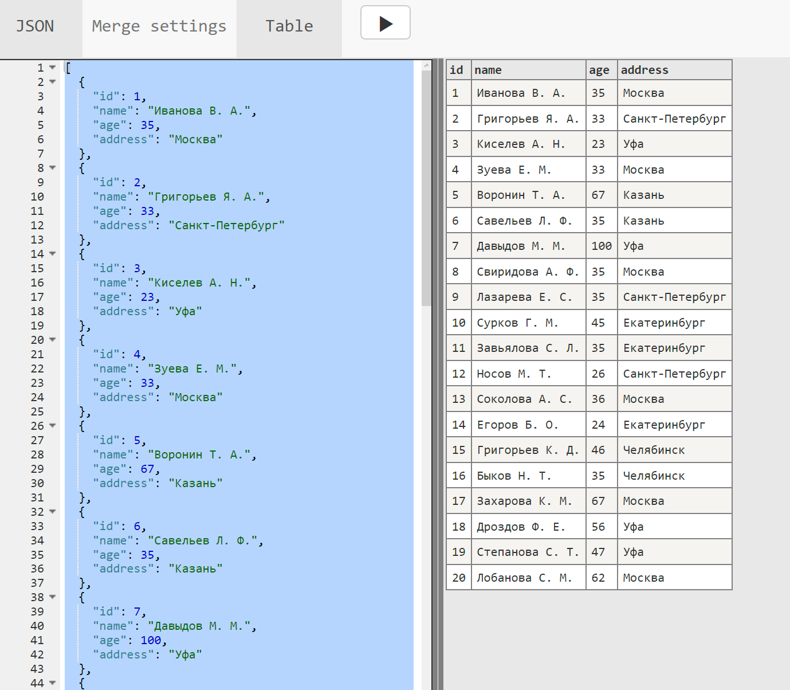

### Задача №1: 
Проверить XML, правильно ли он составлен, не имеет ли он ошибок, если есть какие-либо недочеты, предоставьте правильный вариант в файле 1.xml
```xml
<req>
<surname>Иванов</surname>

<name>Иван</name>

<patronymic>Иванович</patronymic>

<birthdate>01.01.1990</birthdate>

<birthplace>Москва</birthplace>

<phone>8 926 766 48 48</phone>

</req
```
Добавлена декларация и закрыт последний тег </reg<font color=red >></font>

[1.XML:](1.XML)
```xml
<?xml version="1.0"?>
<req>
	<surname>Иванов</surname>
	<name>Иван</name>
	<patronymic>Иванович</patronymic>
	<birthdate>01.01.1990</birthdate>
	<birthplace>Москва</birthplace>
	<phone>8 926 766 48 48</phone>
</req>
```
### Задача №2: 
Проверить JSON, правильно ли он составлен, не имеет ли он ошибок, если есть какие-либо недочеты, предоставьте правильный вариант в файле 2.json
```json
{
"surname": "Иванов"

"name": "Иван"

"patronymic": "Иванович"

"birthdate": "01.01.1990"

"birthplace": "Москва"

"phone": "8 926 766 48 48"

}
```
Добавлены запятые в концах строк (кроме последней). Добавлено представление в виде списка

[2.json:](2.json)
```json
[
  {
    "surname": "Иванов",
    "name": "Иван",
    "patronymic": "Иванович",
    "birthdate": "01.01.1990",
    "birthplace": "Москва",
    "phone": "8 926 766 48 48"
  }
]
```
### Задача №3: 
Составить json по таблице, созданной при выполнении 4-го дз. (информация об одногруппниках с четырьмя полями: id, name, age, address.) Ответ представить в виде файла 3.json и прикрепить скрин, отображающий вид таблицы.
[3.json:](3.json)
```json
[
  {
    "id": 1,
    "name": "Иванова В. А.",
    "age": 35,
    "address": "Москва"
  },
  {
    "id": 2,
    "name": "Григорьев Я. А.",
    "age": 33,
    "address": "Санкт-Петербург"
  },
  {
    "id": 3,
    "name": "Киселев А. Н.",
    "age": 23,
    "address": "Уфа"
  },
  {
    "id": 4,
    "name": "Зуева Е. М.",
    "age": 33,
    "address": "Москва"
  },
  {
    "id": 5,
    "name": "Воронин Т. А.",
    "age": 67,
    "address": "Казань"
  },
  {
    "id": 6,
    "name": "Савельев Л. Ф.",
    "age": 35,
    "address": "Казань"
  },
  {
    "id": 7,
    "name": "Давыдов М. М.",
    "age": 100,
    "address": "Уфа"
  },
  {
    "id": 8,
    "name": "Свиридова А. Ф.",
    "age": 35,
    "address": "Москва"
  },
  {
    "id": 9,
    "name": "Лазарева Е. С.",
    "age": 35,
    "address": "Санкт-Петербург"
  },
  {
    "id": 10,
    "name": "Сурков Г. М.",
    "age": 45,
    "address": "Екатеринбург"
  },
  {
    "id": 11,
    "name": "Завьялова С. Л.",
    "age": 35,
    "address": "Екатеринбург"
  },
  {
    "id": 12,
    "name": "Носов М. Т.",
    "age": 26,
    "address": "Санкт-Петербург"
  },
  {
    "id": 13,
    "name": "Соколова А. С.",
    "age": 36,
    "address": "Москва"
  },
  {
    "id": 14,
    "name": "Егоров Б. О.",
    "age": 24,
    "address": "Екатеринбург"
  },
  {
    "id": 15,
    "name": "Григорьев К. Д.",
    "age": 46,
    "address": "Челябинск"
  },
  {
    "id": 16,
    "name": "Быков Н. Т.",
    "age": 35,
    "address": "Челябинск"
  },
  {
    "id": 17,
    "name": "Захарова К. М.",
    "age": 67,
    "address": "Москва"
  },
  {
    "id": 18,
    "name": "Дроздов Ф. Е.",
    "age": 56,
    "address": "Уфа"
  },
  {
    "id": 19,
    "name": "Степанова С. Т.",
    "age": 47,
    "address": "Уфа"
  },
  {
    "id": 20,
    "name": "Лобанова С. М.",
    "age": 62,
    "address": "Москва"
  }
]
```

